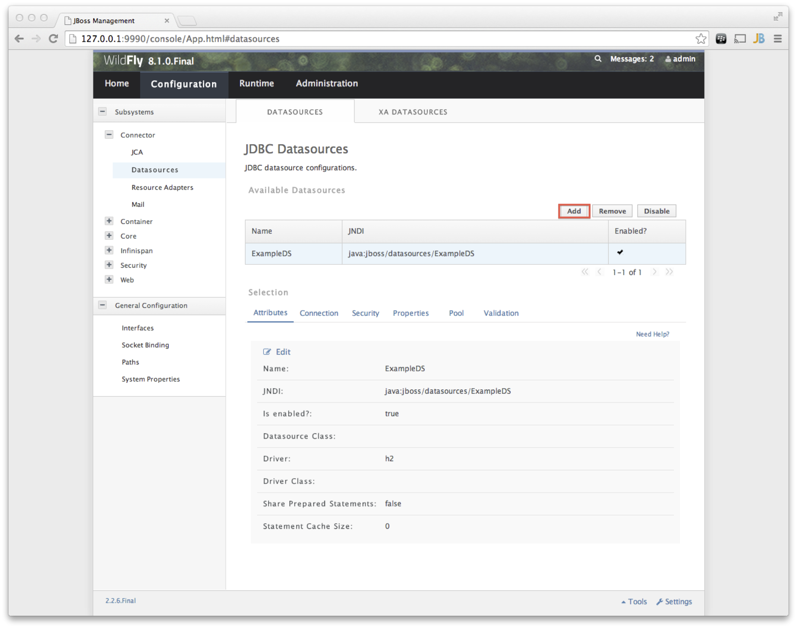
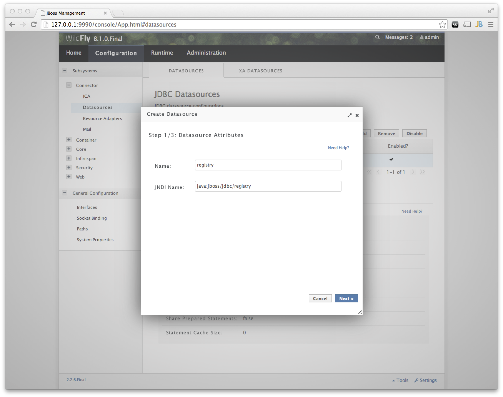
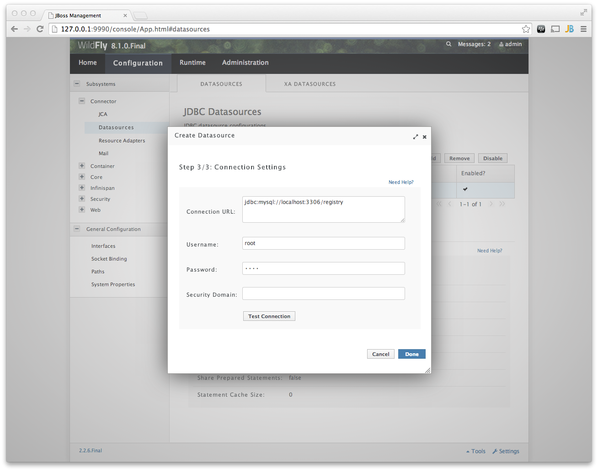

xifi
====

Delivery Mechanism: XIFI Federation

Installation Guide
------------------
Compile
---
```sh 
cd FederationManager
mvn clean install
```

Run WildFly container
---
 ```sh
 cd ../../server/wildfly
 ./bin/standalone.sh
 ```

MySql Setup
---
* log into WildFly AS at localhost:9990 with username "admin" and password "admin"
* under the Profile tab add a new datasource and follow the steps listed in the pictures below


* edit the username and password regarding your MySql server installation

* the registered datasource might have to be enabled
	
Preferences
---
The Federation Manager application defines a set of preferences for configuration. The location of the preferences file depends on the OS used.
* tokenLocation - url to fetch oauth access token, example https://account.lab.fi-ware.org/oauth2/token
* redirectURI   - callback url registered at IDM
* userLocation  - url to fetch user based on access token
* clientId     -  client id assigned by IDM
* environment -  defines the role of the user to use, either "dev_member", "dev_admin", "dev_fm" for development environment or "production" if to be used with IDM authentication/authorization
* errorPage - defines the URL for an error page
* clientSecret - client secret assigned by IDM
* authLocation - url of oauth entry point

Start the application
---
copy the build war-file (step "compile") to `server/wildfly/standalone/deployments/`.
By default, the application runs in development mode, this means no outh identificaton is required. 
To change the role of the user connected, edit the preference `environment`. 
 * dev_member: A user which is a member of an organization, without rights to edit or create new infrastructures.
 * dev_admin: A user which is given the admin role by its organization. Can create, edit or delete infrastructures.
 * dev_fm: A user which belongs to the FederationManager organization. Can see, edit and delete all infrastructures registered.
 * production: This value enables oauth identification, other preferences must be adjusted as well. See the documentation of the [IDM](https://github.com/ging/fi-ware-idm/wiki/Using-the-FI-LAB-instance "KeyRock IDM")for details